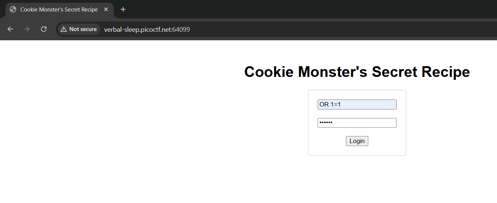
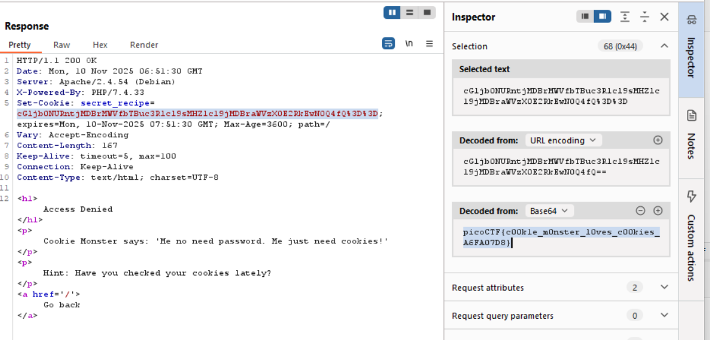

# 🍪 Cookie Monster's Secret Recipe - picoCTF Web Exploitation Writeup

## Challenge Metadata

| Detail | Value |
| :--- | :--- |
| **CTF** | picoCTF |
| **Challenge** | Cookie Monster's Secret Recipe |
| **Category** | Web Exploitation |
| **Difficulty** | Easy |
| **Author** | Brhane Giday and Prince Niyonshuti N. |
| **Solver** | Radzi Zamri |
| **Goal** | Find the hidden secret recipe by analyzing web cookies |

### 🛠️ Tools Used

* **Web Browser** (Developer Tools)
* **Burp Suite** Community Edition

---

## 🔍 Challenge Overview

**Cookie Monster's Secret Recipe** is a web exploitation challenge that focuses on analyzing and decoding information stored in web cookies. The challenge involves uncovering a hidden secret by examining the cookie data set by the application.

---

### 1. Reconnaissance (Initial Analysis)

The challenge description and hints emphasized the importance of cookies in web technologies and checking all parts of the webpage.

* **Action:** I navigated to the login page and attempted various SQL injection payloads including `OR 1=1`.
* **Finding:** The login attempts were unsuccessful, but the application provided a hint about cookies in the response:

    

---

### 2. Analysis (Cookie Examination)

The server response contained valuable information in the form of a cookie that needed further analysis.

* **Action:** I intercepted the login request using **Burp Suite** and examined the server response headers.
* **Finding:** The server set a cookie named `secret_recipes` with a Base64 encoded value:

    ```http
    Set-Cookie: secret_recipes=eC1jbONUEncjMDBrMWYfbTBuc3R1c1ssMHZ1c19jMDBraWVzX0E2BkRwM004f043D43D
    ```

    

---

### 3. Exploit (Cookie Decoding)

The solution required decoding the cookie value to reveal the hidden secret.

1.  **Cookie Extraction:** I extracted the `secret_recipes` cookie value from the server response.

2.  **Base64 Decoding:** The cookie value appeared to be Base64 encoded. I decoded it using Burp Suite's built-in decoder.

3.   **Flag Revelation:** After Base64 decoding, the hidden flag was revealed in the cookie value.

**Decoding Process:**
- Original Cookie: `eC1jbONUEncjMDBrMWYfbTBuc3R1c1ssMHZ1c19jMDBraWVzX0E2BkRwM004f043D43D`
- After Base64 Decode: `picoCTF{c00kie_m0nster_l0ves_c00kies_A6FA070B}`

---

### 4. Flag:

`picoCTF{c00kie_m0nster_l0ves_c00kies_A6FA070B}`

---

### 🧠 Key Concepts & Lessons Learned

* **Web Cookie Analysis:** Cookies often contain hidden or encoded information that can be crucial for solving web challenges.
* **Base64 Encoding:** Many web applications use Base64 encoding to store data in cookies, which can be easily decoded.
* **Developer Tools Proficiency:** Web browser developer tools and intercepting proxies like Burp Suite are essential for examining HTTP headers and cookies.
* **Information in Plain Sight:** As hinted, important information is often hidden in plain sight within HTTP headers and cookies.
* **Cookie Security:** While cookies are essential for web functionality, they should not contain sensitive information in easily decodable formats.


