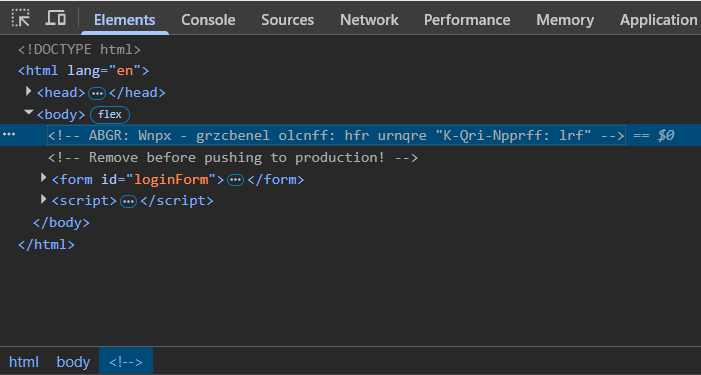
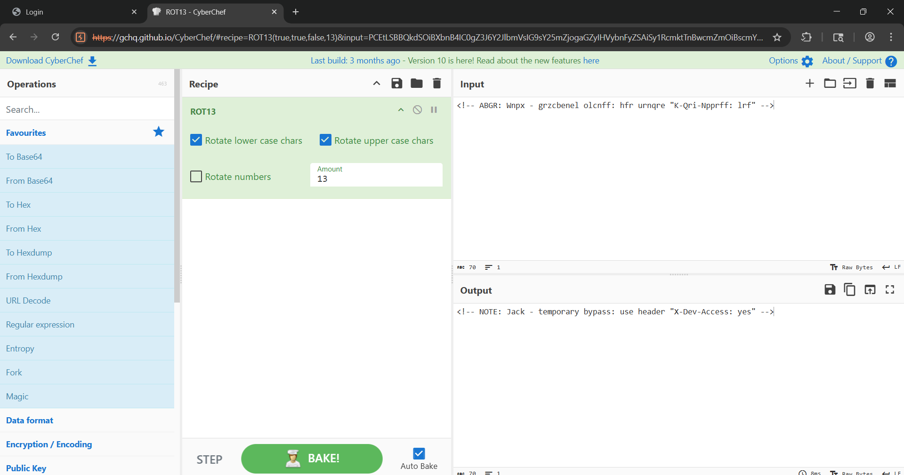
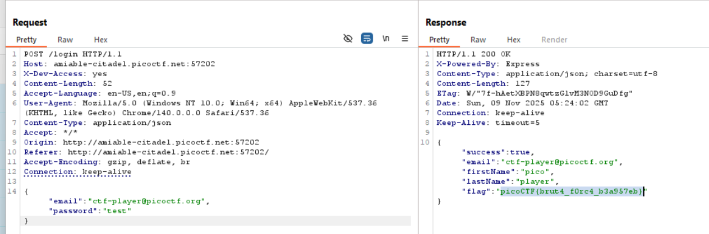

# 🚪 Crack the Gate 1

## Challenge Metadata

| Detail | Value |
| :--- | :--- |
| **Title** | Crack the Gate 1 |
| **Category** | Web |
| **Difficulty** | Easy |
| **Author** | Yahaya Meddy |
| **Solver** | Radzi Zamri |
| **Goal** | Achieve Authentication Bypass via HTTP header injection. |

### 🛠️ Tools Used

* **Web Browser** (Developer Tools)
* **Burp Suite** Community Edition
* **CyberChef**

---

### 1. Reconnaissance (Finding the Leak)

The challenge hints directed us to look for a hidden note left by a developer in the client-side code.

* **Action:** I navigated to the login page and used the browser's **Inspect Element** to examine the **HTML source code**.
* **Finding:** I located a commented-out, encoded string in the body that contained the secret:

    

---

### 2. Analysis (Decoding the Key)

The hints suggested using **ROT13** (rotating letters by 13 positions) to decode the message.

* **Action:** I used **CyberChef** to apply the ROT13 operation on the encoded string.
* **Decoded Key:** The message revealed the essential bypass method:
    `NOTE: Jack - temporary bypass: use header "X-Dev-Access: yes"`

    

---

### 3. Exploit (Header Injection)

The solution required injecting the custom HTTP header found in the decoded note into the login request.

1.  I intercepted a failed login attempt using **Burp Suite Repeater**.
2.  I then manually added the required header to the request: `X-Dev-Access: yes`.

    ```http
    POST /login HTTP/1.1
    Host: amiable-citadel.picoctf.net:57202
    X-Dev-Access: yes  <-- INJECTED BYPASS HEADER
    Content-Type: application/json
    ...
    {"email":"ctf-player@picoctf.org","password":"test"}
    ```

3.  Sending the modified request returned a successful **HTTP 200 OK** response containing the flag.

    

---

### 4. Flag:

`picoCTF{brut4_f0rc4_b3a957eb}`

---

### 🧠 Key Concepts & Lessons Learned

* **Information Leakage:** Always check HTML source code for comments and debugging elements left in production.
* **Cipher Recognition:** Recognize common weak ciphers like ROT13 based on clear hints.
* **HTTP Header Attacks:** Custom, non-standard headers (`X-Dev-Access`) can be an attack vector if they grant elevated privileges without strict server-side validation.

