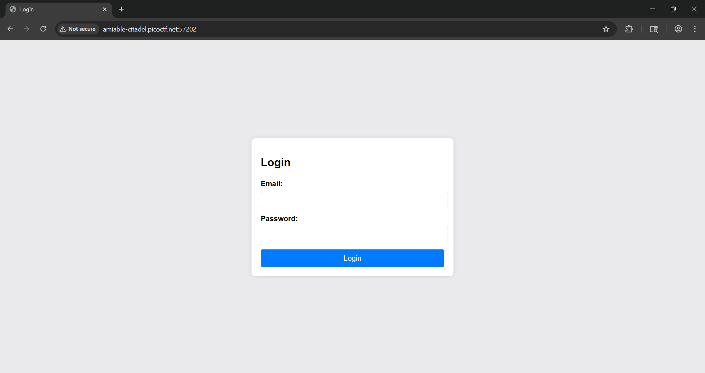

# 🚪 Crack the Gate 1

**CTF:** picoCTF  
**Category:** Web  
**Difficulty:** Easy  
**Author:** Yahaya Meddy  
**Solver:** Radzi Zamri

---

## TL;DR
Found a ROT13‑encoded comment in the page source that reveals a bypass header. Adding `X-Dev-Access: yes` to the login request returns the flag.

---

## Challenge Metadata

| Detail       | Value                                                |
|--------------|------------------------------------------------------|
| **Title**    | Crack the Gate 1                                     |
| **Category** | Web                                                  |
| **Difficulty**| Easy                                               |
| **Author**   | Yahaya Meddy                                         |
| **Solver**   | Radzi Zamri                                          |
| **Goal**     | Achieve authentication bypass and retrieve the flag. |

---

## Tools
- Web browser (Developer Tools)  
- Burp Suite (Repeater)  
- CyberChef

---

## Walkthrough

### 1. Reconnaissance — find the leak
I inspected the login page HTML using browser DevTools and found a commented, encoded string in the page source.

<figure>
  
  <figcaption><strong>Figure 1</strong> — Login page (entry point).</figcaption>
</figure>

<figure>
  
  <figcaption><strong>Figure 2</strong> — Hidden comment in page source (ROT13 encoded).</figcaption>
</figure>

---

### 2. Analysis — decode the key
The encoded string was ROT13. I decoded it with CyberChef and obtained the bypass instruction:

