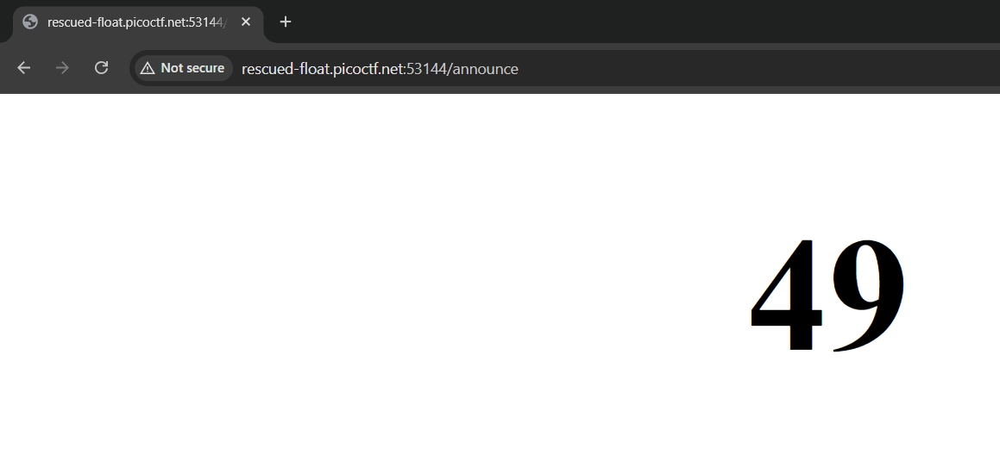
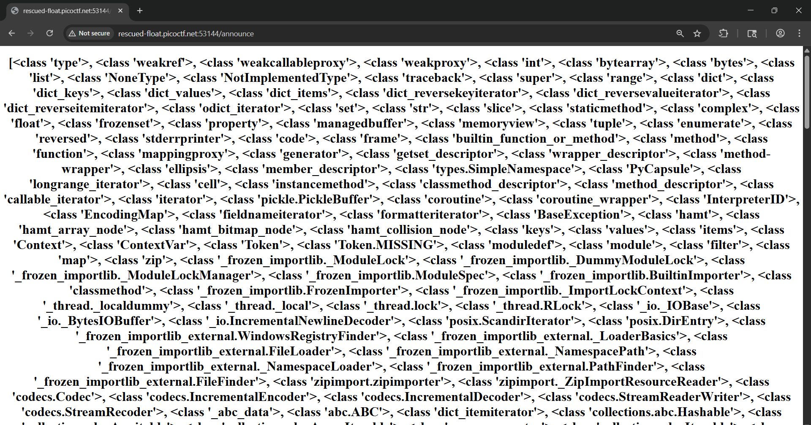
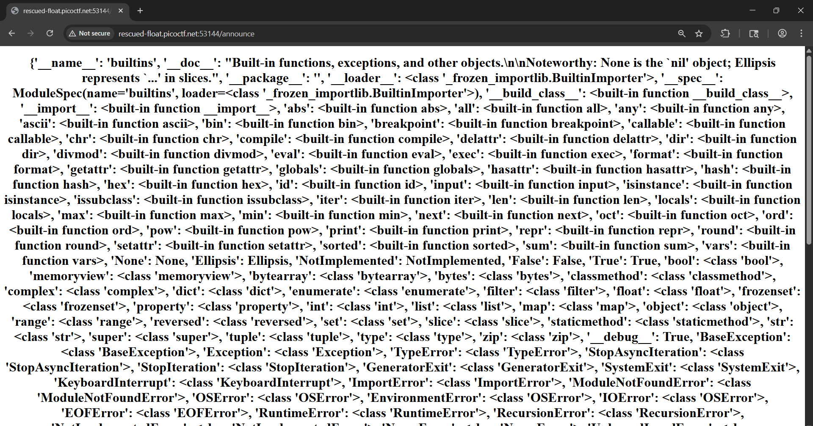
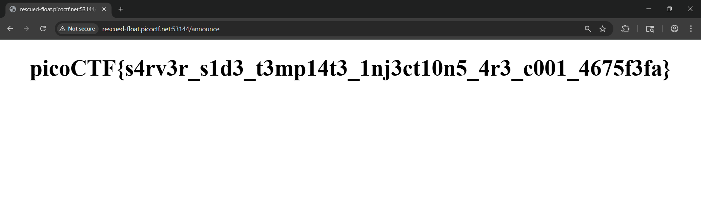

# 🔓 SSTI 1 - picoCTF Web Exploitation Writeup

## Challenge Metadata

| Detail | Value |
| :--- | :--- |
| **CTF** | picoCTF |
| **Challenge** | SSTI 1 |
| **Category** | Web |
| **Difficulty** | Easy |
| **Author** | Venax |
| **Solver** | Radzi Zamri |
| **Goal** | Find the flag by exploiting a Server-Side Template Injection (SSTI) vulnerability. |

### 🛠️ Tools Used

* **Web Browser**
* **Burp Suite** Community Edition

---

## 🔍 Challenge Overview

The challenge description and hints pointed to a **Server-Side Template Injection (SSTI)** vulnerability. The goal was to exploit this flaw in a web application built on **Python/Flask** to achieve Remote Code Execution (RCE) and retrieve the flag.

---

### 1. Reconnaissance (First Look)

* **The Problem:** The website allowed users to "announce" messages, but the input was not properly sanitized.
* **Action:** I sent a simple POST request to the website and checked the server's response headers.
* **What I Found:** The server responded with **`Server: Werkzeug/3.0.3 Python/3.8.10`**. This strongly suggested the website was built using **Flask** with the **Jinja2** template engine, a common SSTI target.


---

### 2. Analysis (Confirming SSTI)

To confirm the template execution vulnerability, a simple mathematical expression was tested.

* **Testing the Vulnerability:** I used Burp Suite Repeater to send a test payload: `{{7*7}}` in the `content` parameter.
* **The Result:** The server calculated and returned **49** in the response. This proved that the server was executing the template code.



---

### 3. Exploit (Getting the Flag)

A successful SSTI chain was constructed to gain access to Python's file reading capabilities.

#### A. Finding Useful Classes

* **Action:** I listed all available Python classes in the environment using the payload: `{{ ''.__class__.__mro__[1].__subclasses__() }}`.
* **Finding:** This returned a long list of classes. I searched this list for a class with access to the `__builtins__` module.



* **Locating File Access:** I tested several indices and found that the class at index **283** had access to the `__builtins__` module, which includes the native **`open()`** function.



#### B. Reading the Flag

* **Action:** Using the `open()` function, I constructed the final payload to read the `flag` file:
    ```python
    {{ ''.__class__.__mro__[1].__subclasses__()[283].__init__.__globals__.__builtins__.open('flag').read() }}
    ```
* **Result:** I sent this payload, and the server successfully executed the file read operation, returning the flag.



---

### 4. Flag:

`picoCTF{s4rv3r_s1d3_t3mp14t3_1nj3ct10n5_4r3_c001_4675f3fa}`

---

### 🧠 Notes / Takeaway

* **Check Server Headers:** Server response headers (like `Werkzeug/Python`) can reveal the technology stack and potential vulnerabilities.
* **SSTI is Powerful:** A successful Server-Side Template Injection can lead to remote code execution (RCE) and full server compromise.
* **Python Internals Help:** In Jinja2 SSTI, you can access Python's internal classes and functions to read files or run commands via the `__subclasses__` method.
* **Sanitize Inputs:** Web applications must always sanitize and validate user input, especially when using template engines.
