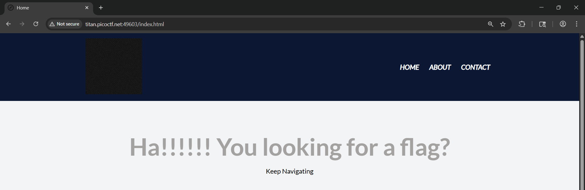
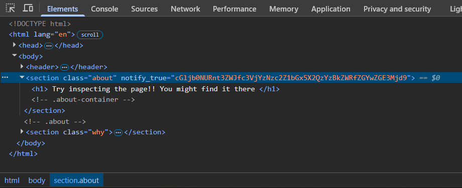
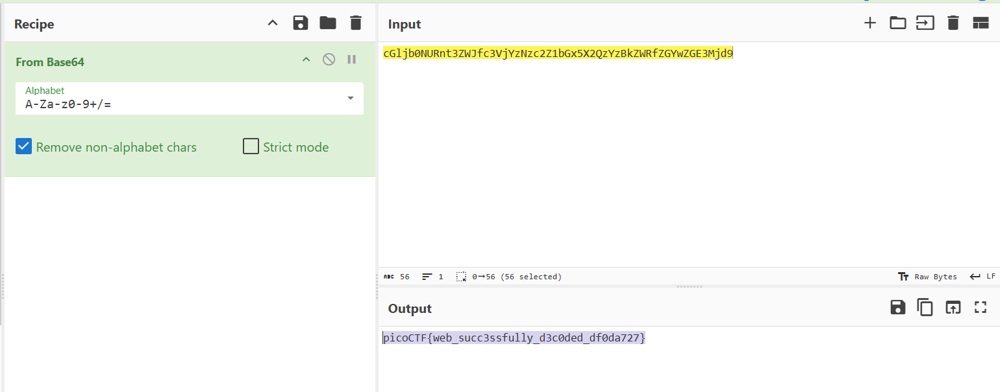

# 🔍 WebDecode - picoCTF Web Exploitation Writeup

## Challenge Metadata

| Detail | Value |
| :--- | :--- |
| **CTF** | picoCTF |
| **Challenge** | WebDecode |
| **Category** | Web Exploitation |
| **Difficulty** | Easy |
| **Author** | Nana Ama Atombo-Sackey |
| **Solver** | Radzi Zamri |
| **Goal** | Find the hidden flag by inspecting web page elements and decoding encoded content |

### 🛠️ Tools Used

* **Web Browser** (Developer Tools)
* **CyberChef**

---

## 🔍 Challenge Overview

**WebDecode** is a web exploitation challenge that focuses on analyzing web page source code and decoding hidden information. The challenge requires using web inspection tools to find and decode the flag.

---

### 1. Reconnaissance (Initial Page Analysis)

The challenge description and hints emphasized using the web inspector to examine the webpage and its included files.

* **Action:** I navigated to the main page and examined the initial content using browser developer tools.
* **Finding:** The homepage contained minimal visible content with a message "Ha!!!!! You looking for a flag?" and a "Keep Navigating" prompt:

    

---

### 2. Analysis (Source Code Inspection)

Following the hint to use the web inspector, I thoroughly examined the HTML source code and page elements.

* **Action:** I used the browser's **Inspect Element** feature to examine all HTML attributes and hidden elements.
* **Finding:** In the `about` section, I discovered a suspicious `notify_true` attribute containing a Base64 encoded string:

    ```
    <section class="about" notify_true="c61jb0NURnt3ZWJfc3VjYzNzc2Z1bGx5X2QzYzBkZWQfZGYwZGE3Mjd9">
    ```

    

---

### 3. Exploit (Decoding the Flag)

The solution required extracting and decoding the Base64 encoded string found in the HTML attribute.

1.  **Extraction:** I copied the encoded string from the `notify_true` attribute: `c61jb0NURnt3ZWJfc3VjYzNzc2Z1bGx5X2QzYzBkZWQfZGYwZGE3Mjd9`
2.  **Base64 Decoding:** I used **CyberChef** to decode the Base64 string, which revealed the flag.
3.  **Flag Revelation:** The decoded output contained the complete flag.

**Decoding Process:**
- Encoded String: `c61jb0NURnt3ZWJfc3VjYzNzc2Z1bGx5X2QzYzBkZWQfZGYwZGE3Mjd9`
- After Base64 Decode: `picoCTF{web_succ3ssfully_d3coded_df0da727}`

    

---

### 4. Flag:

`picoCTF{web_succ3ssfully_d3coded_df0da727}`

---

### 🧠 Key Concepts & Lessons Learned

* **Web Inspector Proficiency:** Mastering browser developer tools is essential for finding hidden information in web challenges.
* **HTML Attribute Analysis:** Important data can be hidden in various HTML attributes beyond visible content.
* **Base64 Encoding Recognition:** Identifying and decoding Base64 encoded strings is a fundamental skill in CTF challenges.
* **Thorough Examination:** The importance of checking all page elements, including attributes, comments, and hidden sections.
* **Progressive Discovery:** Following hints and navigating through different sections of a website to uncover hidden content.

